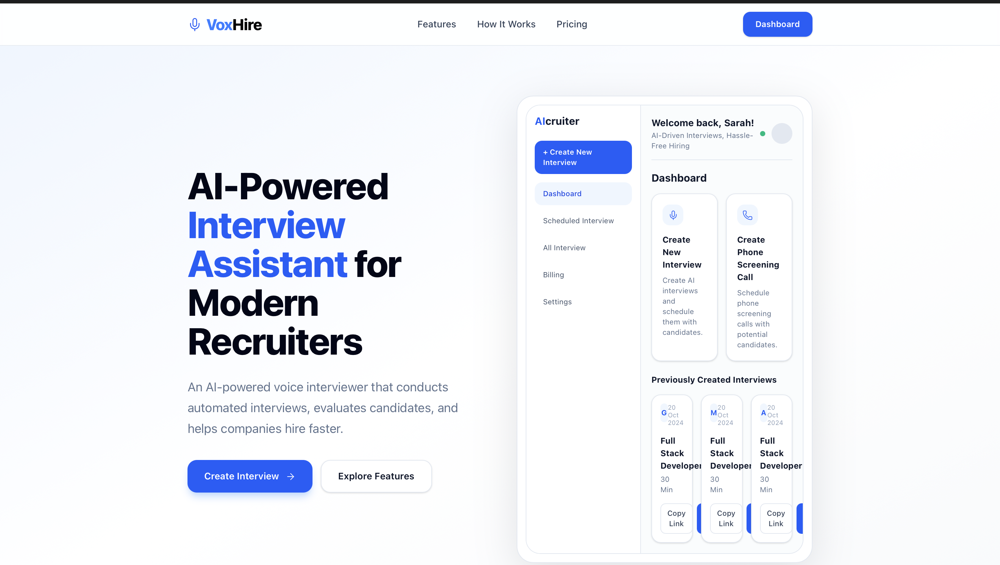
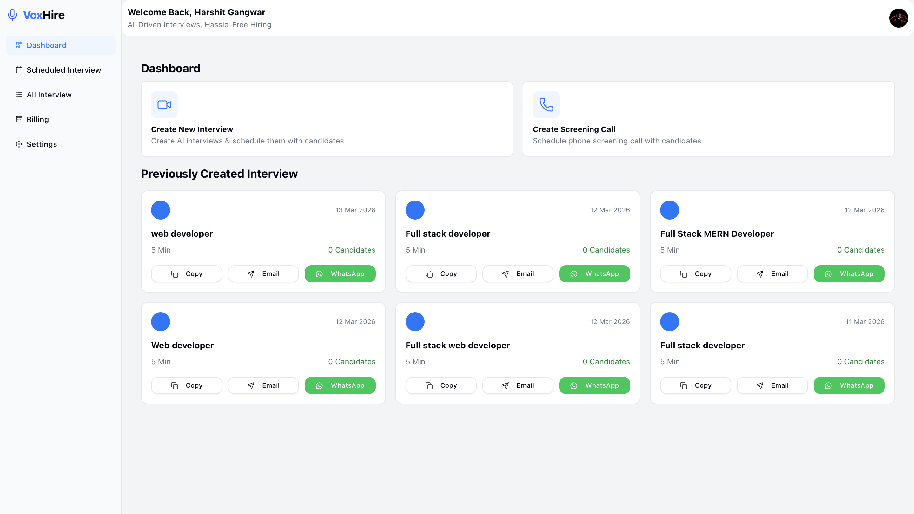

# 🚀 VOX HIRE – AI Recruiter Voice Agent

VOX HIRE is an **AI-powered recruiter voice agent** that can automatically **create and conduct job interviews using voice technology**.

The platform helps automate the **first stage of recruitment**, allowing companies to screen candidates efficiently through **AI-driven voice interviews**.

Candidates join an interview link and interact with an **AI recruiter** that asks questions, listens to answers, and generates structured feedback.

---

# 🌐 Live Demo

**Project Link:**  
https://vox-hire-voice-agent.vercel.app

---

# 💻 GitHub Repository

https://github.com/h1a2r3s4h/VoxHire---Voice-agent

---

# 📸 Screenshots

## Landing Page


## Dashboard


---

# ✨ Features

### 🤖 AI Interview Generation
Automatically generates interview questions using AI prompts.

### 🗣 Voice-based Interviews
Candidates interact with an AI recruiter using **real-time voice conversations**.

### 🧑‍💼 Candidate Management
Recruiters can create interview links and manage candidates.

### 📊 AI Feedback
Generates structured feedback based on candidate responses.

### 🔗 Interview Sharing
Recruiters can easily **share interview links** with candidates.

### 🔐 Authentication
Secure login using **Supabase Authentication (Google OAuth)**.

---

# 🛠 Tech Stack

| Technology | Purpose |
|-------------|-------------|
| **Next.js** | Full-stack React framework |
| **React.js** | Frontend UI |
| **Tailwind CSS** | Modern styling |
| **Vapi AI** | Real-time voice AI conversations |
| **Supabase** | Database, backend, authentication |
| **Vercel** | Deployment |

---

# ⚙️ Installation & Setup

Follow these steps to run the project locally.

## 1️⃣ Clone the Repository

```bash
git clone https://github.com/h1a2r3s4h/VoxHire---Voice-agent.git
```

---

## 2️⃣ Go to Project Folder

```bash
cd VoxHire---Voice-agent
```

---

## 3️⃣ Install Dependencies

```bash
npm install
```

or

```bash
yarn install
```

---

## 4️⃣ Setup Environment Variables

Create a **.env.local** file in the root folder.

```
NEXT_PUBLIC_SUPABASE_URL=your_supabase_url
NEXT_PUBLIC_SUPABASE_ANON_KEY=your_supabase_anon_key
NEXT_PUBLIC_HOST_URL=http://localhost:3000
NEXT_PUBLIC_VAPI_API_KEY=your_vapi_api_key
```

---

## 5️⃣ Run the Development Server

```bash
npm run dev
```

Now open:

```
http://localhost:3000
```

---

# 🚀 Deployment

This project is deployed using **Vercel**.

To deploy:

```bash
npm run build
```

or directly connect the GitHub repository to **Vercel**.

---

# 📸 Screenshots

You can add screenshots here.

Example:

```
/public/screenshots/dashboard.png
/public/screenshots/interview.png
```

---

# 🎯 Future Improvements

- Email OTP authentication for candidates  
- Redis rate limiting for OTP requests  
- RabbitMQ for interview processing  
- AI scoring for candidates  
- Interview analytics dashboard  

---

# 👨‍💻 Author

**Harshit Gangwar**

If you like this project, consider giving it a ⭐ on GitHub.
